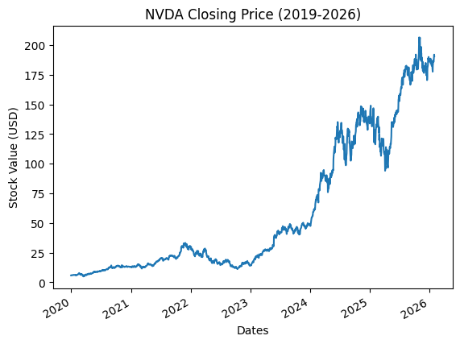

# ticker-risk-analyzer
This program computes ticker metrics like CAGR (Compounded Annual Growth Rate), Sharpe Ratio, Sortino Ratio, and Max Drawdown for a desired ticker over a desired interval.
The program is on analyzer.py and it ran well on Google Colab, so I primarily used that to run and test this program. However, I'm fairly sure it can run on any other Python interpreter.

**Background Information**
For a bit of context, the Sharpe Ratio is the excess returns above the risk-free rate (treasury bills) per unit of total risk (considers large increases of value as a risk: a flaw of the Sharpe Ratio). The Sortino Ratio is similar to the Sharpe Ratio, but it only accounts for downward risk (stock values falling), which makes it more accurate than the Sharpe Ratio at times. The Compounded Annual Growth Rate is the projected average annual growth rate required to progress from the starting value to the ending value. Finally, Max Drawdown is the greatest peak-to-trough change in a stock's value. Sharpe/Sortino are expressed as decimals and annualized by multiplying by √252 where 252 is the number of days in a year when trades can be made. The square root is needed because variance scales linearly with time and standard deviation is the square root of variance, so standard deviation scales with the square root of time, while CAGR and Max Drawdown are expressed as percentages.

**User Input**
The user decides the ticker and the time period through string input statements. These input statements then connect to yfinance (library from Yahoo) and pull the information to track the stock's performance over the selected interval.

**Sharpe Ratio**
To calculate the Sharpe Ratio, I first isolated the closing values from the dataset with data["Close"].squeeze() (squeeze converts the remaining column into a series). I then used pandas to find the daily percent change  and then found the mean and standard deviation of percent change through numpy. I then used the ticker ^IRX to calculate the risk-free rate and computed the mean risk-free rate by dividing by 100 to convert to a decimal. I then divided it by 252 (number of trading days) to make it a daily rate rather than yearly. Finally, I plugged each parameter into the formula (the difference between the portfolio return and risk free rate divided by the standard deviation) to generate a consistent method of generating the Sharpe Ratio.

**Sortino Ratio**
For the Sortino Ratio, I used the same mean risk-free rate and mean daily return as the Sharpe Ratio, but I set every positive daily return to zero and kept all negative returns (setting positive returns to zero makes it so they don't contribute to the sum, but includes them in the denominator to track the frequency of negative days). After that, I squared all the returns, found the mean, and found the square root so the rate becomes percent per day rather than percent squared. Other than changing the standard deviation to only calculate the downside deviation, the process of calculating the Sortino Ratio was similar to calculating the Sharpe Ratio.  

**Compound Annual Growth Rate**
For calculating the CAGR, I first had to calculate the growth rate by dividing the ending closing value by the starting closing value (found them through indexing with [0] and [-1]). Then, I initially used len(close) to count how many entries were in the dataset (number of days), and then divided the days by 252 (number of trading days) to approximate the length of the interval in years, but I pivoted to finding the amount of actual time between the two dates, converting them to days through .days and divided by 365.25 to get the true interval length. I did this because my prior approximation divided by an average rather than measuring the actual calendar time. Finally, I set CAGR equal to the growth rate raised to the power of 1/years minus 1 to find the CAGR.

**Max Drawdown**
Max Drawdown was by far the most complex metric to calculate. I used cummax() to find the "running-peak" of the data set (the highest value as you move through the dataset start to finish). I then created a drawdown = (close/running_peak)-1 statement, which evaluates all the declines from the cumulative peaks. Finally, I used .min() to find the greatest negative value and deemed it the Max Drawdown.

**Chart/Visual**
For the chart, I imported matplotlib since it interacts well with pandas (there was no need for me to define x and y labels since my close variable is a pandas series with an index (closing values and dates), so the dates became the x value and the closing values became the y value). I then created an automatic title that reflects the interval and the ticker selected by the user. Finally, I added labels and cleaned up the graph with some small editing.

**Example Inputs**
Ticker: NVDA
Start Date: 2019-12-31
End Date: 2026-02-01
(The start date is 2019-12-31 instead of 2020-01-01 like on PV because PV uses 12-31-2019's close as the initial balance for January 2020. yfinance excludes the end date, so 2026-02-01 returns data up until the final close of January 2026 (matching PV's end date)).

**Outputs**

Sharpe Ratio: 1.3
Sortino Ratio: 2.0
Max Drawdown: -66.34%                    
CAGR: 77.35%

**Metrics from Portfolio Visualizer for Comparison (Jan 2020 - Jan 2026)**
Sharpe Ratio: 1.4
Sortino Ratio: 2.78
Max Drawdown: -62.82%                    
CAGR: 77.35%

I originally assumed the discrepancy between my script and PV was due to the difference in return frequency (PV uses monthly returns while my script calculates metrics with daily returns), but this theory was only true for one metric. I initially had a gap in CAGR because of how I calculated year count, but my new methodology fixed that gap. The gap in Max Drawdown comes from the difference in frequencies between my script and PV because PV doesn't account for bottoms within a month (only month-end values) while my script does, making my drawdown more accurate. For Sharpe and Sortino, I couldn't attribute a reason to the discrepancy, but my assumption is that it relates in some way to the different frequency and multipliers used for annualization between PV and my script, but I need to investigate further by calculating with monthly returns rather than daily. I also changed how I calculated the Sortino ratio, but that barely changed the result on NVDA.

**Limitations**
I averaged the risk-free rate throughout the inputted interval rather than pairing the daily risk-free rate with the daily percent change, so the Sharpe/Sortino ratios could vary slightly.
This program only analyzes one ticker rather than a multi-asset portfolio, so if the user wants to analyze another ticker, they have to re-run the program.
Sortino considers any positive return as a success, so the targeted benchmark is 0% rather than the risk-free rate from treasury bills.
Sharpe/Sortino have not been calculated at a monthly frequency to truly compare with PV's metrics

