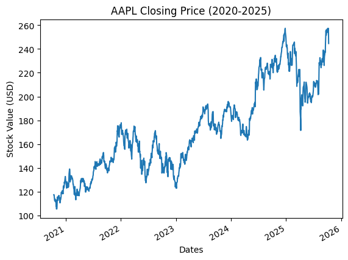

# ticker-risk-analyzer
This program computes ticker metrics like CAGR (Compounded Annual Growth Rate), Sharpe Ratio, Sortino Ratio, and Max Drawdown for a desired ticker over a desired interval.
The program is on analyzer.py and it ran well on Google Colab, so I primarily used that to run and test this program. However, I'm fairly sure it can run on any other Python interpreter.

**Background Information**
For a bit of context, the Sharpe Ratio is the excess returns above the risk-free rate (treasury bills) per unit of total risk (considers large increases of value as a risk: a flaw of the Sharpe Ratio). The Sortino Ratio is similar to the Sharpe Ratio, but it only accounts for downward risk (stock values falling), which makes it more accurate than the Sharpe Ratio at times. The Compounded Annual Growth Rate is the projected average annual growth rate required to progress from the starting value to the ending value. Finally, Max Drawdown is the greatest peak-to-trough change in a stock's value. Sharpe/Sortino are expressed as decimals and annualized by multiplying by √252 where 252 is the number of days in a year when trades can be made. The square root is needed because variance scales linearly with time and standard deviation is the square root of variance, so standard deviation scales with the square root of time, while CAGR and Max Drawdown are expressed as percentages.

**User Input**
The user decides the ticker and the time period through string input statements. These input statements then connect to yfinance (library from Yahoo) and pull the information to track the stock's performance over the selected interval.

**Sharpe Ratio**
To calculate the Sharpe Ratio, I first isolated the closing values from the dataset with data["Close"].squeeze() (squeeze converts the remaining column into a series). I then used pandas to find the daily percent change  and then found the mean and standard deviation of percent change through numpy. I then used the ticker ^IRX to calculate the risk-free rate and computed the mean risk-free rate by dividing by 100 to convert to a decimal. I then divided it by 252 (number of trading days) to make it a daily rate rather than yearly. Finally, I plugged each parameter into the formula (the difference between the portfolio return and risk free rate divided by the standard deviation) to generate a consistent method of generating the Sharpe Ratio.

**Sortino Ratio**
For the Sortino Ratio, I used the same mean risk-free rate and mean daily return as the Sharpe Ratio, but I adjusted the standard deviation to only include percent changes below zero (since Sortino only accounts for downward risk while Sharpe accounts for total risk). Other than changing the standard deviation, the process of calculating the Sortino Ratio was similar to calculating the Sharpe Ratio.  

**Compound Annual Growth Rate**
For calculating the CAGR, I first had to calculate the growth rate by dividing the ending closing value by the starting closing value (found them through indexing with [0] and [-1]). I then used len(close) to count how many entries were in the dataset (number of days), and then divided the days by 252 (number of trading days) to approximate the length of the interval in years. Finally, I set CAGR equal to the growth rate raised to the power of 1/years minus 1 to find the CAGR.

**Max Drawdown**
Max Drawdown was by far the most complex metric to calculate. I used cummax() to find the "running-peak" of the data set (the highest value as you move through the dataset start to finish). I then created a drawdown = (close/running_peak)-1 statement, which evaluates all the declines from the cumulative peaks. Finally, I used .min() to find the greatest negative value and deemed it the Max Drawdown.

**Chart/Visual**
For the chart, I imported matplotlib since it interacts well with pandas (there was no need for me to define x and y labels since my close variable is a pandas series with an index (closing values and dates), so the dates became the x value and the closing values became the y value). I then created an automatic title that reflects the interval and the ticker selected by the user. Finally, I added labels and cleaned up the graph with some small editing.

**Example Inputs**
Ticker: AAPL
Start Date: 2020-10-13
End Date: 2025-10-13

**Outputs**

Sharpe Ratio: 0.55
Sortino Ratio: 0.82
Max Drawdown: -33.36%                    
CAGR: 15.87%

**Metrics from Portfolio Visualizer for Comparison (Oct 2020 - Oct 2025)**
Sharpe Ratio: 0.69
Sortino Ratio: 1.19
Max Drawdown: -26.40%                    
CAGR: 18.79%
(The discrepancy between my results and the results from Portfolio Visualizer can be explained by PV's calculation process differing from mine. PV calculates based on monthly returns, while my program utilizes daily returns, so my results would display more volatility, which would affect the Sharpe/Sortino Ratios. The same daily-to-monthly difference creates the ~7% difference in max drawdown because the timeframe used in my program captures low points within the month that PV doesn't include. Additionally, the timeframe in my program was 2020-10-13 to 2025-10-13 while PV's timeframe was October 2020 to October 2025, so PV includes 26 days that aren't presented in my original timeframe).

**Limitations**
I averaged the risk-free rate throughout the inputted interval rather than pairing the daily risk-free rate with the daily percent change, so the Sharpe/Sortino ratios could vary slightly.
I used the standard deviation of all negative returns (<0) rather than measuring below a set target.
Years are approximated as days/trading days rather than calculated with calendar dates.
This program only analyzes one ticker rather than a multi-asset portfolio, so if the user wants to analyze another ticker, they have to re-run the program.

